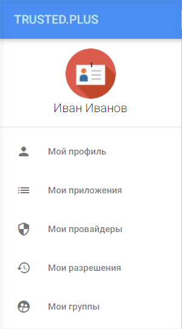

# Личный кабинет пользователя

После авторизации или регистрации открывается профиль пользователя. 

Слева отображается аватарка пользователя и его псевдоним, а также навигационная панель для переключения между вкладками страницы, состоящая из разделов:
- Мой профиль,
- Мои приложения,
- Мои провайдеры, 
- Мои разрешения, 
- Мои группы.

 
В верхней части расположена кнопка информации о профиле, при нажатии на которую отображается окно с информацией о пользователе, кнопка быстрого перехода на вкладку **Мой профиль** и кнопка **Выход**.               
    
 

                	 
	
