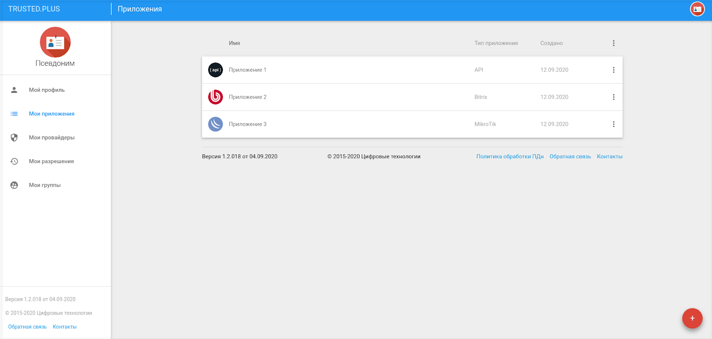
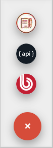

# Мои приложения
	
На вкладке **Мои приложения** у пользователя отражаются приложения, используемые для авторизации на тех или иных ресурсах. Пользователь может быть как владельцем приложения, создав его самостоятельно, так и приглашенным в него администратором, имеющим полномочия менять настройки приложения. Во втором случае приложение самостоятельно добавлять не требуется, оно появится автоматически на данной вкладке после согласия пользователя на участие в группе администраторов.

 

В данный момент в сервисе авторизации TRUSTED PLUS поддерживаются несколько типов приложений:

- КриптоАРМ Документы,
- API,
- BITRIX. 
  
Настройки того или иного типа приложений имеют свои особенности, имеющие отражение в различном интерфейсе для каждого из них.

Все приложения пользователя выводятся в форме cписка. Для создания нового приложения пользователю следует на вести курсор мыши на кнопку добавления (+) в правом нижнем углу формы и выбрать иконку с нужным типом приложения. 

 

Для редактирования настроек приложения необходимо осуществить одиночный щелчок мышью по строке с обозначением приложения. 

Для удаления приложения или изменения его параметров общего характера можно воспользоваться меню действий, вызываемого по клику в правой части строки с наименованием приложения.

 
 	 	 
	 Меню действий с приложением

6.2. Основное окно настроек приложения
Основное окно настроек приложения позволяет создателю/администратору приложения:
●	получать общие сведения о приложении (ClientId, Владелец);
●	регулировать способы авторизации через приложение;
●	настроить параметры авторизации;
●	предъявлять определенные требования к идентификационным данным пользователей;
●	запрашивать у пользователей TRUSTED PLUS права к данным их аккаунтов;
●	настраивать внешний вид виджета авторизации приложения.

Примечание: далее рассматривается редактирование настроек приложения на примере приложения типа API.

  

Основное окно настроек приложения

В верхней части окна расположена иконка для изменения картинки приложения.
В блоке Общие сведения отображается уникальный идентификатор (ClientId) приложения, а также имя и фамилия его владельца.

 
Блок Общие сведения

В блоке Способы авторизации можно настроить способ авторизации для пользователей как по логину-паролю, так и по внешним аккаунтам у провайдеров.

 
Блок Способы авторизации
 Список доступных для авторизации через приложение провайдеров регулируется в блоке Список провайдеров.

 
Блок Список провайдеров
Провайдеры добавляются и удаляются в данном блоке при помощи типовых интерфейсных кнопок.

 	 
Кнопка Добавить	Кнопка Удалить

В блоке Настройки авторизации можно ограничивать авторизацию пользователей кругом участников, определяемых администраторами приложения, активировать опцию сбора статистики о пользователях и, в случае необходимости, требовать у авторизуемых лиц наличия определенных идентификаторов для входа (электронный ящик, телефона) в личном профиле.

 
Блок Настройки авторизации

Блок Запрос на права к аккаунту пользователя содержит набор прав, которые требуются приложению от авторизованных пользователей. 	

 
Блок Запрос на права к аккаунту пользователя
Блок Внешний вид  позволяет менять цветовую палитру окон виджета авторизации приложения, а также изменять цвет шрифта в виджете.

 	 
 Блок Внешний вид виджета приложения	Окно выбора цветовой схемы виджета

	В самой нижней части окна расположен блок подсказок для подключения виджета приложения на сайте, а также кнопка для эмуляции вызова окна виджета приложения на сайте, и кнопка перехода к документации по API сервиса.

 
Блок подсказок в окне настроек приложения
