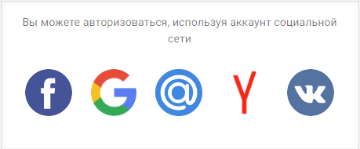
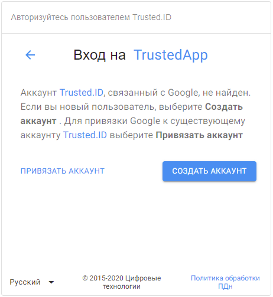
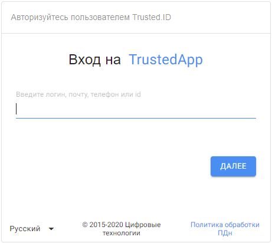
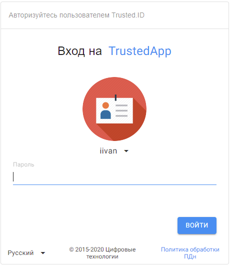
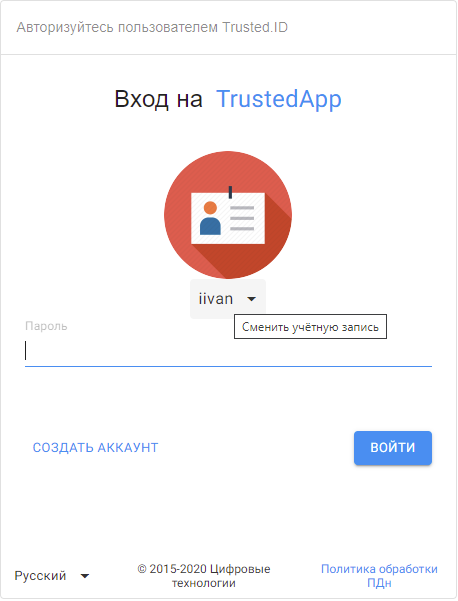
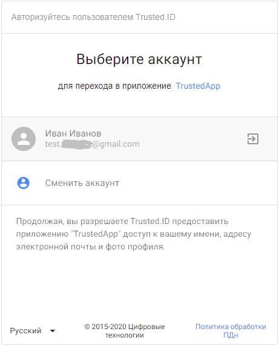
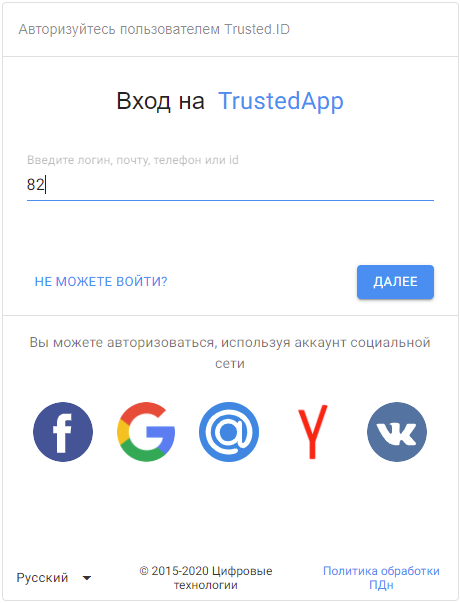
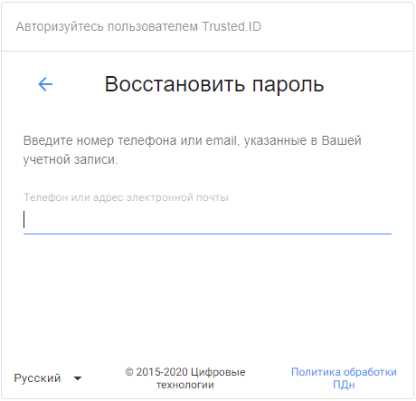
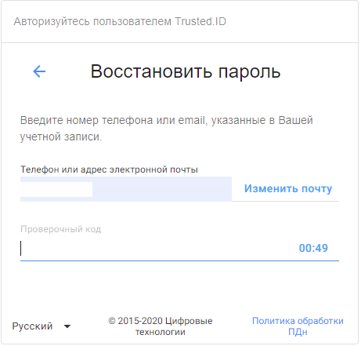
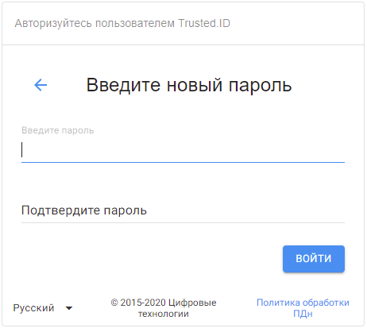

# Авторизация в сервисе

## Авторизация по логину/паролю

Форма авторизации в сервисе состоит из 2-х частей. В первой части вы можете пройти авторизацию по идентификатору (номер телефона, id, логин, email) или через социальную сеть. 

 ")

В качестве идентификатора вы можете использовать:

●	логин;

●	электронную почту, заранее прикрепленную к вашему профилю;

●	номер телефона, заранее прикрепленный к вашему профилю;

●	id (указанный в профиле пользователя).

После введенного идентификатора  нажмите на активную кнопку **Далее**.  

Во второй части формы авторизации отражается ваша аватарка и псевдоним, а также поле для ввода пароля. 
 
")

После введения пароля нажмите на кнопку **Войти**.  

Происходит вход в **Личный кабинет** пользователя.

## Авторизация через социальные сети. 

В форме авторизации выберите нужную социальную сеть для авторизации. 

После выбора социальной сети (в нашем примере разбирается авторизация по Google) авторизуйтесь под своим логином и паролем. Если ваш аккаунт прикреплен к вашему профилю, то вы автоматически авторизуетесь в своем профиле. 

В том случае, когда аккаунт в социальной сети не прикреплен ни к одному из ваших профилей, открывается форма выбора действия. 

 

Если у вас есть зарегистрированный профиль в сервисе, то вы можете привязать аккаунт к данному профилю, нажав на **Привязать аккаунт**.  Открывается поле ввода идентификатора с последующем вводом пароля. После прохождения авторизации открывается профиль с привязанным аккаунтом в разделе **Внешние аккаунты**. 

 

Если у вас еще нет профиля в сервисе, в форме выбора действий кликните **Создать аккаунт**. После перехода на виджет регистрации, пройдите регистрацию, описанную в разделе **Регистрация нового пользователя**. 

## Смена профиля

Если вы хотите сменить аккаунт, то кликните на свой **Псевдоним** (Сменить учетную запись).  

Происходит переход на страницу выбора необходимого профиля. 

При нажатии **Сменить аккаунт** открывается виждет авторизации.

")

## Восстановление пароля

Для восстановления пароля есть 2 варианта.

1-й вариант. В форме авторизации на уровне введения идентификатора, начните вводить свой идентификатор, при появлении надписи **Не можете войти**, кликните на нее. 

2-й вариант. После введения вашего идентификатора и прохождения на форму введения пароля, начните вводить сиволы пароля, кликните на надпись **Не можете войти**.

")

В открывшемся списке, выберите Восстановить пароль.

")

В открывшемся виджете введите телефон или адрес электронной почты, которые прикреплены к вашему профилю.

  

На указанный идентификатор (телефон или адрес электронной почты) придет проверочный код, который нужно ввести в поле ввода. 

 
Если проверочный код вы не ввели в положенное время или он не пришел, то есть возможность запросить код повторно. 

В открывшемся окне введите обязательные поля ввода новый пароль и его подтверждение. 

 После успешной смены пароля вы автоматически попадете в свой профиль.