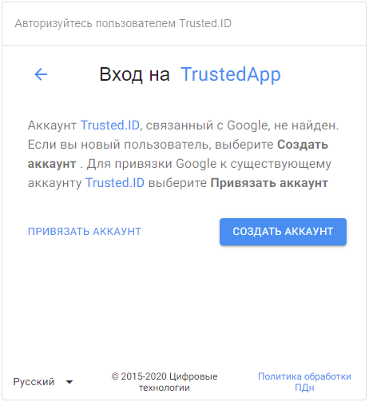

# Регистрация пользователя

## Регистрация нового пользователя

Для использования сервиса в полном объеме необходимо пройти регистрацию пользователя. После перехода на главную страницу вам открывается виджет авторизации.

 

Чтобы создать новый профиль нажмите на **Создать аккаунт**. 
Открывается окно cоздания аккаунта, где происходит ввод данных для регистрации нового пользователя.

") 

В форме представлены следующие обязательные поля ввода:

- **Укажите ваше имя** - позволит сервису обращаться к вам.
- **Придумайте логин**. Логин должен быть уникальным для сервиса, в дальнейшем с помощью него вы сможете авторизовываться.  Логин пользователя может включать латинские буквы (a-z), цифры (0-9) и точку (.) без подчеркивания, минимум 3 символов, максимум 30 . Одно слово или разделено точкой. 
- **Дата рождения**. Минимальным возрастом для управления аккаунтом считаем 14 лет. Вы можете самостоятельно ввести дату или воспользоваться календарем. 
- **Пароль и его подтверждение**. Минимальное количество символов 8, максимальное 32.
- **Согласие на обработку персональных данных**. Установите флаг для своего согласия. Если вы хотите ознакомится с  политикой персональных данных на нашем сервисе, кликните на выделенных цветом часть надписи.  

После заполнения всех полей, нажмите на активную кнопку **Далее**.  

Если в настройках приложения стоит обязательность наличия номера телефона и/или email, то открывается 2-я форма виджета регистрации для добавления требуемых идентификаторов.

")

Запрашиваться могут оба идентификатора или любой из них, зависит от настройки приложения. 

Если в настройках приложения не указана обязательность наличия номера телефона и/или email, то этот шаг пропускается.

После введения номера/email происходит проверка на уникальность данного идентификатора, если эти данные используются в сервисе, то появится информационное сообщение **Идентификатор занят**.

 

После успешной регистрации происходит вход в **Личный кабинет** пользователя без повторной авторизации. 

## Регистрация пользователя через социальные сети

В форме авторизации выберите нужную социальную сеть для авторизации. 

Когда аккаунт в социальной сети не прикреплен ни к одному из ваших профилей, открывается форма выбора действия, в которой можно создать аккаунт. 

 

Нажмите **Создать аккаунт**. После перехода на виджет регистрации, пройдите регистрацию, описанную в разделе **Регистрация нового пользователя**. 