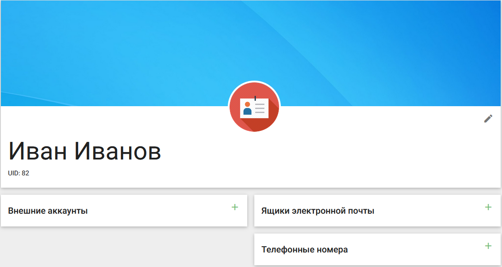

# Редактирование профиля

На вкладке **Мой профиль** можно редактировать пользовательские данные.

В средней части окна расположена иконка изменения аватара пользователя.

При клике по иконке изменения аватарки откроется системное окно выбора фотографии на локальной машине пользователя. Максимальный размер изображения 1 Мб.

В правой части - кнопка редактирования профиля пользователя.

	
В окне редактирования пользователь может изменить свои идентификационные данные (Имя, Фамилия, Логин, Псевдоним), изменить приватность своего профиля в поиске, указать другой пароль для входа в профиль, изменить дату рождения, удалить аккаунт и скачать персональные данные в JSON формате.

По кнопке **Сохранить** изменения сохраняются.
По кнопке **Отмена** или по клику вне области редактирования, окно закрывается без сохранения изменений. 

Для удаления пользователя на форме редактирования в разделе **Дополнительно** следует выбрать опцию **Удалить аккаунт**.
Открывается окно подтверждения удаления.

При выборе **Да** пользователь удалиться без восстановления. Возможна только повторная регистрация.