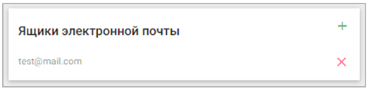
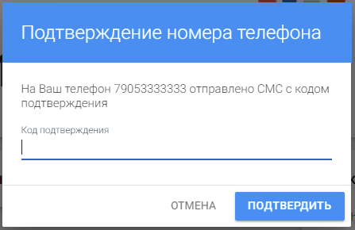

# Мой профиль
 
Первая вкладка, с которой начинается работа в сервисе - **Мой профиль**.

Она позволяет настраивать пользователю способы авторизации в сервисе, менять персональные данные и пароль для авторизации.

Окно вкладки разбито на несколько основных блоков: 
- Внешние аккаунты, 
- Ящики электронной почты, 
- Телефонные номера.

 В каждом из блоков присутствуют типовые элементы интерфейса, позволяющие работать с данными внутри каждого из них: это кнопки **Добавить** и **Удалить**.

 

Для работы с сервисом у пользователя обязательно должен быть добавлен один из обязательных идентификаторов - номер телефона или адрес электронной почты.
Если ни один идентификатор не задан, то появляется информационное сообщение об этом с предложением добавить номер телефона.

По кнопке **Выход** происходит выход из сервиса. При последующей авторизации данное сообщение появится снова.

По кнопке **Да** открывается окно ввода номера телефона. 

## Внешние аккаунты

В данном блоке пользователь может добавлять различные аккаунты для входа в сервис TRUSTED PLUS. 
 

При нажатии на кнопку добавлнения открывается список с выбором доступных внешних провайдеров, через которые пользователь сможет авторизовываться на сервисе.

 При выборе провайдера открывается окно авторизации в выбранном сервисе. Далее пользователю следует авторизироваться, либо этот этап будет пройден автоматически, в случае, если пользователь работает в браузере уже залогиненым в социальной сети (например, пользователь уже авторизован в VK).
 
Удобство данного механизма заключается в том, что если пользователь работает в браузере уже авторизованным в какой-либо социальной сети или сервисе (например, Yandex) для входа в TRUSTED PLUS ему будет достаточно  в виджете авторизации выбрать соответствующую иконку внешнего провайдера, и вход в приложение произойдет автоматически без необходимости выбирать логин и пароль. В случае, если авторизация перед входом в TRUSTED PLUS не произошла, пользователю потребуется ввести данные своего аккаунта во внутреннем интерфейсе сервиса во всплывающем модальном окне.

## Ящики электронной почты

В этом блоке  представлены все адреса электронной почты пользователя. В профиль можно добавить неограниченное количество ящиков электронной почты.

 

 Для прикрепления почты к профилю достаточно выбрать кнопку добавления в данном блоке. В открывшемся окне необходимо ввести адрес электронной почты. 

 

Далее пользователю потребуется ввести проверочный код, высылаемый на добавляемый почтовый ящик. После введения проверочного кода, почтовый ящик добавляется в профиль. 

Также на добавляемый почтовый ящик приходит ссылка, при прохождении по которой email автоматически добавляется в профиль. В этом случае введение проверочного кода не требуется, просто нажмите **Отмена** в открывшемся окне. В дальнейшем адрес электронной почты может быть использован для авторизации. 

## Телефонные номера

В этом блоке  представлены все номера телефонов пользователя. 

Пользователь также может добавить в профиль неограниченное количество телефонных номеров путем нажатия на кнопку добавления. В открывшемся окне необходимо ввести добавляемый номер телефона.

 Для подтверждения каждого из них необходимо ввести проверочный код, присылаемый СМС-уведомлением на телефон пользователя.

 
В дальнейшем номер телефона может быть использован для авторизации.
